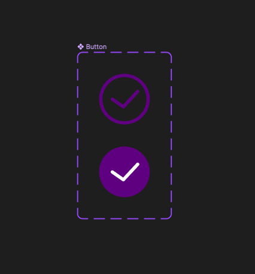

# React 1주차 과제

- Figma를 사용해 아토믹(atomic) 컴포넌트를 설계(design)한 후, 리액트 컴포넌트로 구현
- 칼리 장바구니 페이지 전체 선택 체크박스 부분 구현
- [피그마링크](https://www.figma.com/file/CDSQtjO7hygL08Le5heTYD/%EC%95%84%ED%86%A0%EB%AF%B9-%EC%BB%B4%ED%8F%AC%EB%84%8C%ED%8A%B8?type=design&node-id=0%3A1&mode=dev)

